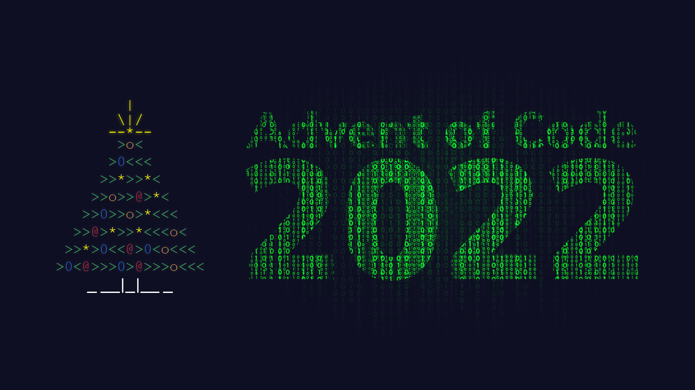

# Advent of Code 2022 - The C Edition


<p align="center">
  
</p>

## Introduction

Advent of Code is an Advent calendar of small programming puzzles for a variety
of skill sets and skill levels that can be solved in any programming language
you like. People use them as interview prep, company training, university
coursework, practice problems, a speed contest, or to challenge each other.

## Instructions to follow along

Make sure you have a C compiler installed. There are many popular ones out
there like `gnu` or `clang`.

```sh
# clone this repository
git clone https://github.com/7ze/the_c_programming_language_solutions.git

# change or modify as you like

# to compile, run make
make

# to clean all executables and debug files, run
make clean
```
